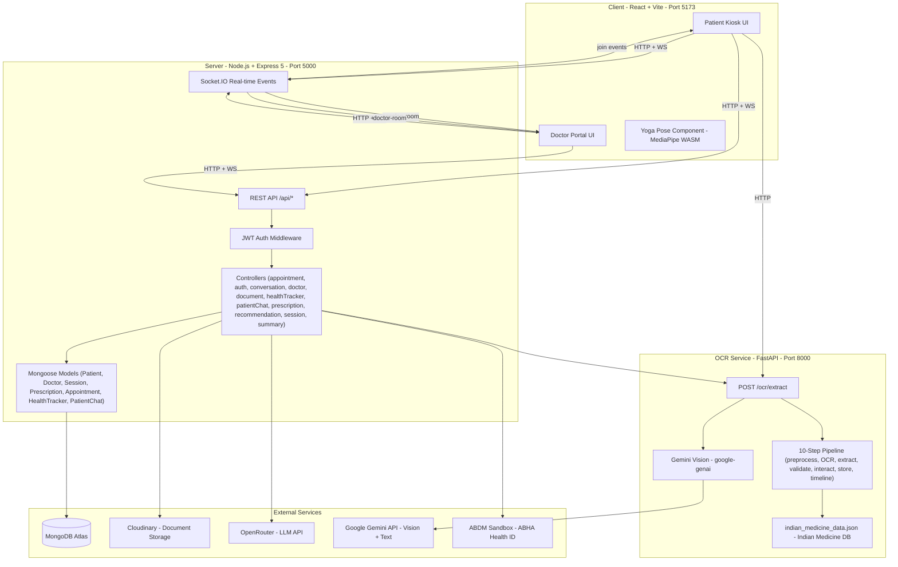
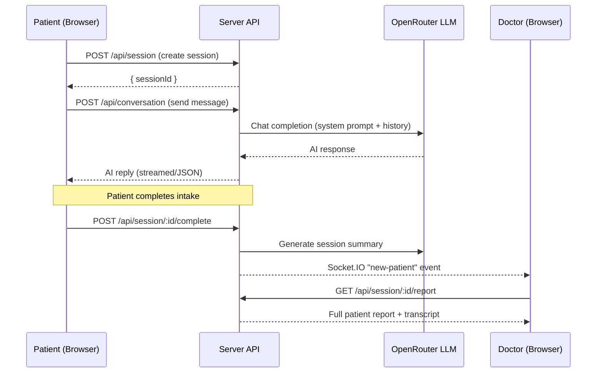

# SwasthyaSetu — AI-Powered Patient Care Platform

**SwasthyaSetu** ("Health Bridge") is an intelligent, end-to-end healthcare platform built for Smart India Hackathon (SIH). It digitises the traditional patient consultation workflow — from history-taking and prescription OCR to real-time doctor-patient collaboration — using AI at every step.

---

## Table of Contents

1. [Features](#features)
2. [How It Works](#how-it-works)
3. [Architecture](#architecture)
4. [Project Structure](#project-structure)
5. [Getting Started](#getting-started)
6. [Environment Variables](#environment-variables)
7. [API Reference](#api-reference)
8. [Deployment](#deployment)
9. [Tech Stack](#tech-stack)

---

## Features

| Module | Description |
|---|---|
| **AI History Taking** | Conversational AI (via OpenRouter LLM) conducts a structured medical history interview with the patient |
| **Prescription OCR** | Gemini-powered vision pipeline extracts medicines, dosages, and instructions from prescription photos |
| **Doctor Portal** | Real-time queue management, patient case review, and prescription composer for doctors |
| **Health Tracker** | Log and chart vitals (BP, glucose, weight, SpO2) with trend analysis |
| **Yoga Pose Checker** | Camera-based real-time yoga pose assessment using MediaPipe landmarks |
| **Ayurveda Recommendations** | Curated lifestyle and Ayurvedic wellness suggestions based on patient profile |
| **Appointments** | Book, manage, and track doctor appointments |
| **Document Management** | Upload and retrieve medical documents via Cloudinary |
| **Multilingual UI** | Full language context supporting 10 Indian languages (Hindi, Bengali, Tamil, Telugu, Marathi, Gujarati, Kannada, Malayalam, Punjabi, English) |
| **Reminders** | Medication and appointment reminders |

---

## How It Works

### Overview

SwasthyaSetu replaces the traditional paper-based OPD workflow at Indian hospitals with a fully digital, AI-assisted pipeline. A patient walks into a hospital, sits at a kiosk (or uses their phone), and the system handles the rest — from intake to prescription.

### Step-by-Step Patient Journey

**1. Registration and Login**

The patient registers using their name, phone number, and basic demographics. The system creates a profile in MongoDB and issues a JWT token. ABHA (Ayushman Bharat Health Account) integration is supported for linking to the national health ID system.

**2. AI-Powered History Taking**

Once logged in, the patient starts a new consultation session. An AI interviewer (powered by OpenRouter LLM — Gemini or Claude) conducts a structured medical history interview:

- The AI asks exactly 5-6 focused questions, one at a time.
- Each question comes with 4-5 multiple-choice options for easy tap input (critical for kiosk usability).
- Questions follow a clinical structure: chief complaint, duration/onset, severity, past medical history, and a final catch-all.
- The entire conversation happens in the patient's preferred language (10 Indian languages supported).
- Red flags (chest pain radiating to arm, sudden weakness, etc.) are detected in real-time and flagged immediately.
- The AI extracts structured clinical data from each response (chief complaint, symptoms, timing, severity).

All conversation history is stored per-session in MongoDB, maintaining a full audit trail.

**3. Document Upload and OCR**

Patients can upload existing prescriptions, lab reports, or discharge summaries. The system processes them through a two-tier OCR pipeline:

- **Primary path**: The uploaded image is sent to the OCR microservice (FastAPI + Gemini Vision), which runs a 10-step pipeline — preprocessing (OpenCV), OCR extraction (Gemini Vision API), structured field extraction, validation against an Indian medicine database (96 MB reference dataset), drug-interaction checks, and timeline construction.
- **Fallback path**: If the microservice is unavailable, the server calls Gemini Vision API directly for basic extraction.
- Extracted data includes: doctor name, hospital, diagnoses, medications (with dosage, frequency, duration, timing), lab results (with abnormality detection), vitals, and procedures.
- All extracted data is merged into the patient's unified medical history.

**4. Session Completion and Doctor Notification**

When the AI interview is complete (or the patient finishes), the session is marked complete. The server generates an AI-powered summary of the entire session and sends a real-time Socket.IO event (`new-patient`) to the doctor room, alerting all online doctors that a new patient is ready for review.

**5. Doctor Review and Prescription**

The doctor portal is a separate interface within the same SPA:

- **Queue Page**: Doctors see a real-time queue of patients who have completed their AI intake. New patients appear instantly via Socket.IO.
- **Patient Report**: The doctor views the full AI-generated report — chief complaint, symptom timeline, past medical history, uploaded documents with OCR extractions, and the complete AI conversation transcript.
- **Prescription Composer**: The doctor writes a digital prescription with medications, dosages, instructions, and diagnoses. The prescription is stored and linked to the session.

**6. Health Tracking**

Patients can log vitals (blood pressure, blood sugar, weight, SpO2, heart rate) over time. The system stores time-series data and the frontend renders trend charts using Recharts, enabling both patients and doctors to monitor health metrics longitudinally.

**7. Yoga and Exercise**

The exercise module includes a camera-based yoga pose checker built on MediaPipe. It detects body landmarks in real-time, calculates joint angles using geometric functions, and compares them against a library of asana definitions with accuracy thresholds. Patients get live feedback on their pose correctness.

**8. Ayurveda Recommendations**

Based on the patient's profile, symptoms, and health data, the system provides curated Ayurvedic and lifestyle recommendations from a static knowledge base.

### Real-Time Communication

Socket.IO powers all real-time features:

- Patients join a `session-{id}` room when they start an AI interview.
- Doctors join a `doctor-room` on login.
- Session completion events, new patient alerts, and prescription updates are broadcast in real-time.
- JWT authentication is enforced at the Socket.IO handshake level.

### Security

- All API routes are protected by JWT middleware (Bearer token in Authorization header).
- Role-based access control separates patient and doctor permissions.
- Helmet sets security headers, CORS is configured with explicit origin allowlists, and express-rate-limit prevents abuse.
- Passwords are hashed with bcryptjs before storage.

---

## Architecture



### Data Flow — AI History Taking Session



---

## Project Structure

```
SwasthyaSetu/
├── client/                        # React 19 + Vite — Patient and Doctor SPA
│   ├── src/
│   │   ├── api/                   # Axios API layer (auth, doctor, health, documents)
│   │   ├── components/
│   │   │   ├── layout/            # AppLayout, DoctorShell, ProtectedRoute
│   │   │   ├── ui/                # Reusable UI atoms (cards, charts, icons)
│   │   │   └── yoga/              # YogaPoseCheckerModal (MediaPipe)
│   │   ├── context/               # AuthContext, LanguageContext, PreferencesContext
│   │   ├── pages/
│   │   │   ├── doctor/            # Doctor portal pages (Queue, Prescription, Records)
│   │   │   └── *.jsx              # Patient pages (Dashboard, HealthTracker, Exercise)
│   │   ├── services/              # Pose detection service (MediaPipe)
│   │   ├── styles/                # global.css + doctor.css
│   │   └── utils/                 # Speech, format, async helpers
│   ├── public/                    # favicon, SVG icon sprite
│   ├── vite.config.js
│   └── package.json
│
├── server/                        # Node.js + Express 5 REST API + Socket.IO
│   ├── config/                    # db.js (Mongoose), cloudinary.js
│   ├── controllers/               # Business logic for every route group
│   ├── data/                      # ayurvedaRecommendations.js (static data)
│   ├── middleware/                # auth.js (JWT), errorHandler.js
│   ├── models/                    # Mongoose schemas
│   ├── routes/                    # Express routers (one per domain)
│   ├── services/                  # aiService, ocrService, medicalHistoryService, speechService
│   ├── utils/                     # ApiError, ApiResponse, asyncHandler, abha.js
│   ├── public/js/                 # speechUtils.js (served as static asset)
│   ├── server.js                  # Entry point
│   └── package.json
│
├── ocr pipeline/                  # Python FastAPI — Prescription OCR Microservice
│   ├── api/                       # FastAPI app (main.py, schemas.py)
│   ├── ocr/                       # Gemini OCR provider
│   ├── extraction/                # LLM-based field extraction
│   ├── preprocessing/             # Image preprocessing (OpenCV)
│   ├── pipeline/                  # 10-step orchestration pipeline
│   ├── medicine/                  # Indian medicine vocabulary layer
│   ├── interactions/              # Drug-interaction checks
│   ├── validation/                # Prescription validation rules
│   ├── labs/                      # Lab result parsing
│   ├── storage/                   # Persistence layer
│   ├── timeline/                  # Medication timeline builder
│   ├── observability/             # Logging and metrics
│   ├── ingestion/                 # Batch ingestion helpers
│   ├── benchmark/                 # Accuracy benchmarking
│   ├── tests/                     # pytest test suite
│   ├── indian_medicine_data.json  # Indian medicine reference database (96 MB)
│   ├── requirements.txt
│   └── .env
│
└── yoga_pose/                     # Standalone Yoga Pose Assessment
    └── kushagra_pipeline/
        ├── index.html             # Self-contained UI
        ├── app.js                 # MediaPipe integration + UI logic
        ├── geometry.js            # Angle and joint calculations
        ├── pose_definitions.js    # Asana library with thresholds
        ├── styles.css
        └── yoga_engine.py         # Python pose analysis (server-side option)
```

---

## Getting Started

### Prerequisites

| Tool | Version |
|---|---|
| Node.js | >= 20 |
| npm | >= 10 |
| Python | >= 3.10 |
| MongoDB | >= 6 (local or Atlas) |

---

### 1. Clone the Repository

```bash
git clone https://github.com/your-org/swasthyasetu.git
cd swasthyasetu
```

---

### 2. Backend Server (server/)

```bash
cd server
cp .env.example .env   # Fill in your values (see Environment Variables)
npm install
npm run dev            # Starts on http://localhost:5000
```

---

### 3. Frontend Client (client/)

```bash
cd client
cp .env.example .env   # Set VITE_API_URL
npm install
npm run dev            # Starts on http://localhost:5173
```

---

### 4. OCR Microservice (ocr pipeline/)

```bash
cd "ocr pipeline"
python -m venv venv

# Windows:
venv\Scripts\activate
# macOS/Linux:
source venv/bin/activate

pip install -r requirements.txt
cp .env.example .env   # Set GEMINI_API_KEY

# Start the FastAPI server
uvicorn api.main:app --reload --port 8000
```

---

### 5. Yoga Pose Module (yoga_pose/)

The yoga pose checker is integrated directly into the React client via YogaPoseCheckerModal.jsx (uses MediaPipe via CDN). No separate server is needed for the browser-based version.

To run the standalone HTML version:

```bash
# Open directly in browser — no build step needed
yoga_pose/kushagra_pipeline/index.html
```

---

## Environment Variables

### server/.env

| Variable | Description | Required |
|---|---|---|
| `PORT` | Server port (default: 5000) | No |
| `NODE_ENV` | `development` or `production` | No |
| `MONGODB_URI` | MongoDB connection string | Yes |
| `JWT_SECRET` | Secret key for JWT signing | Yes |
| `JWT_EXPIRE` | Token expiry (e.g. `7d`) | No |
| `CLOUDINARY_CLOUD_NAME` | Cloudinary account name | Yes |
| `CLOUDINARY_API_KEY` | Cloudinary API key | Yes |
| `CLOUDINARY_API_SECRET` | Cloudinary API secret | Yes |
| `OPENROUTER_API_KEY` | OpenRouter LLM API key | Yes |
| `ML_SERVICE_URL` | URL of OCR microservice | No |
| `ABDM_CLIENT_ID` | ABDM Sandbox client ID | No |
| `ABDM_CLIENT_SECRET` | ABDM Sandbox secret | No |
| `ABDM_BASE_URL` | ABDM gateway URL | No |
| `CLIENT_URL` | Comma-separated allowed origins | No |

### client/.env

| Variable | Description |
|---|---|
| `VITE_API_URL` | Backend API base URL (e.g. `http://localhost:5000/api`) |

### ocr pipeline/.env

| Variable | Description |
|---|---|
| `GEMINI_API_KEY` | Google Gemini API key |

---

## API Reference

| Method | Endpoint | Description |
|---|---|---|
| `GET` | `/api/health` | Health check |
| `POST` | `/api/auth/register` | Patient registration |
| `POST` | `/api/auth/login` | Patient login |
| `POST` | `/api/session` | Start a history-taking session |
| `GET` | `/api/session/:id` | Get session details |
| `POST` | `/api/conversation` | Send a message in a session |
| `GET` | `/api/documents` | List patient documents |
| `POST` | `/api/documents` | Upload a document |
| `GET` | `/api/health-tracker` | Get health metrics |
| `POST` | `/api/health-tracker` | Log a health metric |
| `GET` | `/api/appointment` | List appointments |
| `POST` | `/api/appointment` | Create appointment |
| `GET` | `/api/prescription/:sessionId` | Get prescription |
| `POST` | `/api/prescription` | Create prescription (doctor) |
| `GET` | `/api/recommendations` | Ayurveda recommendations |
| `POST` | `/api/doctor/register` | Doctor registration |
| `POST` | `/api/doctor/login` | Doctor login |

**OCR Service:**

| Method | Endpoint | Description |
|---|---|---|
| `POST` | `/ocr/extract` | Extract prescription data from image |

---

## Deployment

### Backend — Render / Railway

1. Set all environment variables in your service dashboard.
2. **Start command:** `node server.js`
3. Set `NODE_ENV=production`.
4. Set `CLIENT_URL` to your deployed frontend URL.

### Frontend — Vercel / Netlify

1. **Build command:** `npm run build`
2. **Output directory:** `dist`
3. Set `VITE_API_URL` to your deployed backend URL.
4. Add SPA routing rewrite:

**Vercel (vercel.json):**
```json
{
  "rewrites": [{ "source": "/(.*)", "destination": "/index.html" }]
}
```

**Netlify (public/_redirects):**
```
/* /index.html 200
```

### OCR Service — Render / Fly.io

```bash
# Start command
uvicorn api.main:app --host 0.0.0.0 --port $PORT
```

Set `GEMINI_API_KEY` in the environment. Update `ML_SERVICE_URL` in server/.env to point to the deployed OCR service URL.

---

## Tech Stack

| Layer | Technology |
|---|---|
| **Frontend** | React 19, Vite 8, React Router 7, Recharts, Lucide React |
| **Styling** | Vanilla CSS (custom design system) |
| **Backend** | Node.js, Express 5, Socket.IO 4 |
| **Database** | MongoDB + Mongoose 9 |
| **Auth** | JWT (jsonwebtoken + bcryptjs) |
| **File Storage** | Cloudinary |
| **AI / LLM** | OpenRouter (Gemini / Claude via unified API) |
| **OCR** | Google Gemini Vision (google-genai) |
| **OCR Framework** | Python FastAPI + Uvicorn |
| **Image Processing** | OpenCV (headless), Pillow |
| **Pose Detection** | MediaPipe (WASM in browser) |
| **Security** | Helmet, CORS, express-rate-limit, express-validator |

---

## License

ISC - SwasthyaSetu Team - SIH 2024
